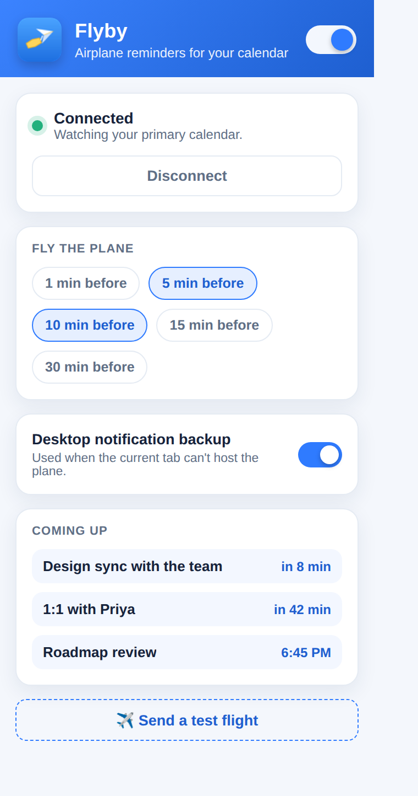

# Flyby ✈️

> A tiny airplane tows a banner across your screen a few minutes before your next Google Calendar meeting.


Flyby is a **Manifest V3 Chrome/Chromium extension**. It watches your Google
Calendar and, a few minutes before a timed event begins, flies a little
airliner towing a fabric banner with the meeting name and how soon it starts
across whatever page you're looking at. It's a friendlier, harder-to-ignore nudge than a toast that
vanishes in three seconds — but it never blocks your clicks and never touches
the page's own styling.

If the tab you're on can't host the plane (a `chrome://` page, the Web Store,
etc.), Flyby quietly falls back to a desktop notification instead.

---

## Features

- 🛩️ **A realistic little airliner** (fuselage, cockpit window, window row, swept
  wing, engine, tail fin) towing a **fabric banner** — all drawn as inline SVG in
  a **Shadow DOM**, so it can't collide with the page's CSS and the page can't
  hide it. It's `pointer-events: none`, so your clicks pass straight through.
- 🌬️ **Real-ish banner physics** — a small `requestAnimationFrame` loop flutters
  the banner as a *traveling wave* (more whip toward the free end), sags it under
  gravity, and couples it to the plane's gentle bob and pitch. The red message —
  the event name plus a small `· in 10 min` tag — rides the wave via an SVG
  `textPath`, and auto-fits (short titles centered and large, long ones
  compressed and clipped with an ellipsis, with the time tag always kept).
- ⏱️ **Pick your lead times** — 1, 5, 10, 15 and/or 30 minutes before an event.
  Choose more than one and the plane flies at each.
- 🔔 **Desktop-notification fallback** when the active tab is a restricted page.
- ♿ **Respects `prefers-reduced-motion`** — a gentle fade-in near the top instead
  of a fly-across.
- 🧹 **Sensible filtering** — skips all-day events, cancelled events, and invites
  you've declined.
- 🔒 **Read-only** calendar access (`calendar.events.readonly`). No servers, no
  analytics; everything stays in your browser.

## What it looks like

| The reminder | The popup |
| --- | --- |
|  |  |

---

## Install (load unpacked)

> **Just want to use it?** See **[INSTALL.md](INSTALL.md)** for a short, plain-language walkthrough, or open the built-in guide from the popup (**Open the step-by-step guide**). The steps below are the same thing in detail.

Flyby talks directly to Google's Calendar API, so you supply your own **free**
OAuth client ID. It's a one-time setup, ~5 minutes.

### 1. Get the code

```bash
git clone https://github.com/NamanSharma2112/Flyby.git
```

Keep the folder somewhere stable — for an unpacked extension Chrome derives the
extension ID from the folder path, and the OAuth client below is tied to that ID.

### 2. Load it in Chrome to discover its ID

1. Open `chrome://extensions`.
2. Turn on **Developer mode** (top-right).
3. Click **Load unpacked** and select the `Flyby` folder.
4. Copy the **ID** shown on the Flyby card (a long string like
   `abcdefghijklmnopabcdefghijklmnop`).

The extension loads, but connecting will fail until you finish step 4 — that's
expected.

### 3. Create a Google OAuth client

1. Go to the [Google Cloud Console](https://console.cloud.google.com/) and create
   or pick a project.
2. **APIs & Services → Library** → search **Google Calendar API** → **Enable**.
3. **APIs & Services → OAuth consent screen**:
   - User type **External** is fine.
   - Fill in the required app name / support email.
   - Under **Test users**, add your own Google address. (In "Testing" mode you
     don't need Google to verify the app — only your test users can sign in,
     which is all you need.)
   - Add the scope `https://www.googleapis.com/auth/calendar.events.readonly`.
4. **APIs & Services → Credentials → Create credentials → OAuth client ID**:
   - **Application type: Chrome Extension** (older consoles label this
     *Chrome App*).
   - Paste the **extension ID from step 2** into the *Item ID* / *Application ID*
     field.
   - Create it and copy the **Client ID** (ends in `.apps.googleusercontent.com`).

### 4. Drop the client ID into the manifest

Open `manifest.json` and replace the placeholder in `oauth2.client_id`:

```json
"oauth2": {
  "client_id": "YOUR_CLIENT_ID.apps.googleusercontent.com",
  "scopes": ["https://www.googleapis.com/auth/calendar.events.readonly"]
}
```

Back on `chrome://extensions`, click the **reload** ↻ icon on the Flyby card.

### 5. Connect and fly

Click the Flyby toolbar icon → **Connect Google Calendar** → approve the
read-only request. Pick your lead times, then hit **✈️ Send a test flight** to see
the plane cross your current tab right away.

---

## How it works

```
manifest.json          MV3 manifest, OAuth config, permissions
src/background.js       service worker — OAuth, 1-min calendar poll, fires the plane
src/content.js          injected on demand — draws & animates the plane (Shadow DOM)
src/popup.html/.js/.css settings, connection, onboarding, upcoming events, test button
src/setup.html/.js      the built-in step-by-step setup guide (opened from the popup)
icons/                  extension icons (regenerate with tools/make_icons.py)
tools/build_zip.py      package a load-unpacked-ready flyby-<version>.zip
```

**Build a distributable zip:** `python3 tools/build_zip.py` → `flyby-<version>.zip`
(unzips to a `flyby/` folder you can Load unpacked).

- **Auth** uses `chrome.identity.getAuthToken`, so Chrome manages and refreshes
  the token for background polling. A `401` transparently clears the cached token
  and re-mints one.
- **Polling** is a once-a-minute `chrome.alarms` job. It pulls timed events from
  your **primary** calendar for the next hour and, when one first crosses a
  configured lead time, fires the plane exactly once per event/lead-time (tracked
  in `chrome.storage`).
- **Rendering** happens by injecting `content.js` into the active tab and passing
  it the title. The plane + banner are inline SVG inside a Shadow DOM; a
  `requestAnimationFrame` loop rebuilds the rippling banner path each frame and
  the overlay removes itself when the flight ends. (Under
  `prefers-reduced-motion` it fades in gently instead of flying across, with the
  physics loop switched off.)
- **Permissions:** `identity` (OAuth), `storage` (settings + de-dupe), `alarms`
  (polling), `scripting` (draw on the active tab), `notifications` (fallback).
  Host permissions: `https://www.googleapis.com/*` (the API) and `<all_urls>` (to
  draw the plane on whatever page you happen to be viewing).

---

## Privacy

Flyby runs entirely on your machine and only ever contacts Google's Calendar API
with a **read-only** scope. There is no backend, no telemetry, and event titles
appear only on your own screen. **Disconnect** in the popup removes the cached
token and revokes the grant.

## Customizing

| Want to change… | Where |
| --- | --- |
| Default lead times | popup chips, or `DEFAULT_SETTINGS` in `src/background.js` |
| Which calendar | `CALENDAR_ID` in `src/background.js` (default `"primary"`) |
| Plane / banner look | `PLANE` markup and the `<defs>` gradients in `src/content.js` |
| Banner flutter / sag | `AMP`, `OMEGA`, `K` (and `baseline()`) in `src/content.js` |
| Flight speed & lanes | `FLIGHT_S` and `LANES` in `src/content.js` |
| Icons | edit and rerun `python3 tools/make_icons.py` |

## Browser support

Any Chromium browser with Manifest V3 and `chrome.identity.getAuthToken` —
Chrome, Edge, Brave, Arc, Vivaldi, etc. Firefox uses a different identity API and
isn't supported as-is.

## Ideas / roadmap

- Watch multiple calendars (needs the broader `calendar.readonly` scope +
  iterating `calendarList`).
- Custom banner colors and per-event messages.
- Snooze / "seen it" dismissal.
- Optional chime.

## License

[MIT](LICENSE)
